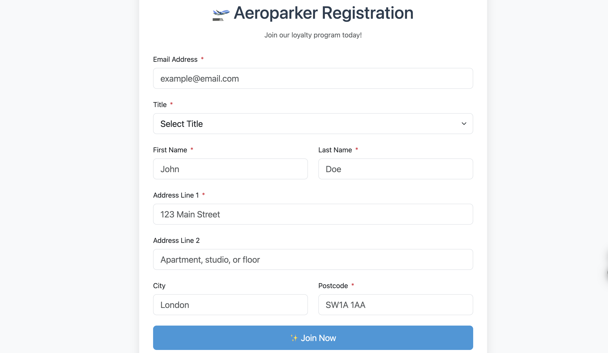

# Aeroparker Coding Challenge Solution

A customer registration system built with:
- Java 17
- Spring Boot
- MySQL
- Bootstrap 5

## Features
✅ Registration form with validation  
✅ Success page with confirmation details  
✅ Database persistence  
✅ Duplicate email prevention  
✅ Responsive design

## Setup
1. **Requirements**:
   - Java 17
   - MySQL Server
   - Maven

2. **Database Setup**:
   ```sql
   CREATE DATABASE aeroparker;
   ```

3. **Run Application**:
   ```bash
   mvn clean spring-boot:run
   ```

4. Access at: `http://localhost:8080/registration`

## Project Structure
```
├── src/
│   ├── main/
│   │   ├── java/com/example/demo/
│   │   │   ├── controllers/
│   │   │   ├── models/
│   │   │   └── repositories/
│   │   └── resources/
│   └── test/
└── pom.xml
```

## Screenshots


